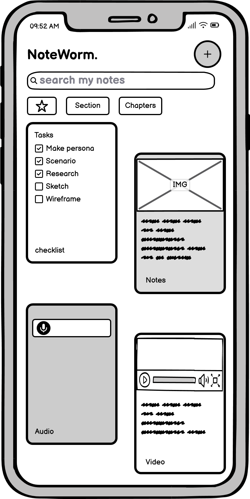
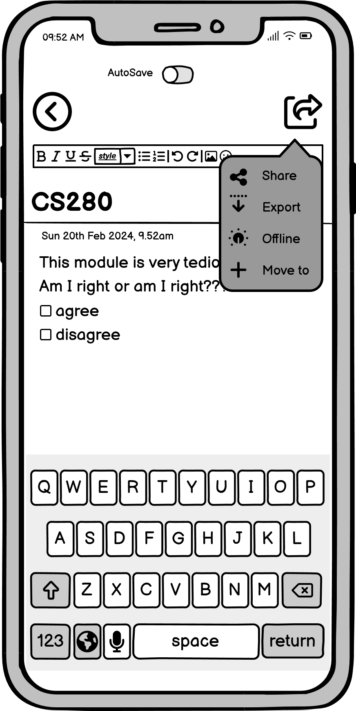
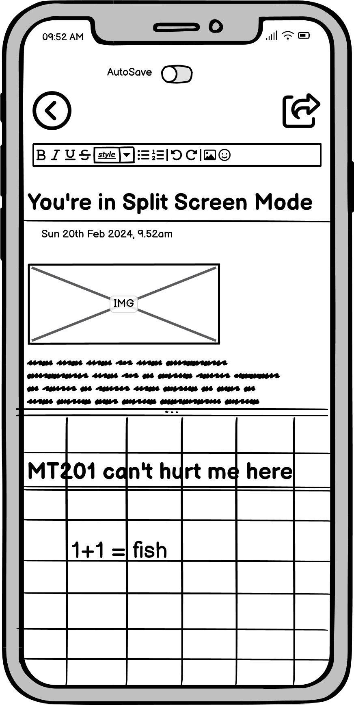
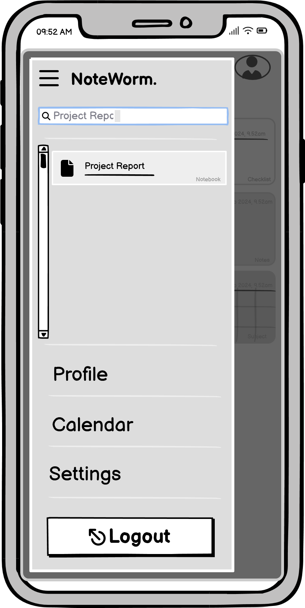
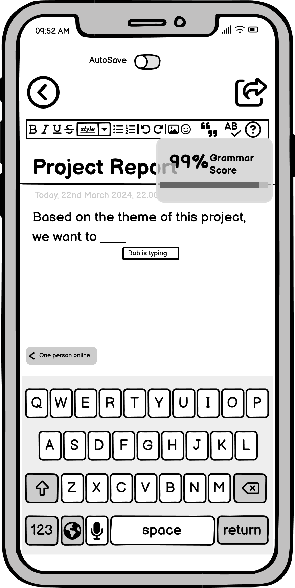

# NoteWorm 📝
CS280 Intro to UX/UI and Interaction Design project.  
Theme: Note-taking app  
Designed using Balsamiq.

### The project
`NoteWorm` is a mobile note-taking app designed for students who need to digitise their way of studying. If you are those who want to get away from the physical clutter of books and the smell of paper, then this is the app for you! 

- `Reasearch_Features_Sketch.pdf`: research on existing apps, considered features, and hand drawn sketches of my design idea. 
- `Persona.pdf`: persona representing my users, outling who they are and how do they represent the users that will use my app. 
- `Scenario.pdf`: scenario explaining why they need this app, how they've come to this app and why it solves their problem.
- `Self-Reflection`: reflection on my first wireframe and decisions made on design and feature improvements. 
- `Wireframes`: folder containing my first and improved wireframes.
- `PDF files`: folder containig the clickable PDF forms of my two wireframes. 

### Criteria
- Conduct online research on existing apps and identify key features.
- Develop a realistic scenario and persona of the most typical user of the mobile app.
- Prepare quick hand-drawn sketches of your app design.
- Create fully clickable, low fidelity wireframes of your proposed design.
- Reflect and re-improve your design from feedback received from peers.

### Original low-fi wireframe

  
  
  
  
  
  

### Improved with added features 

  
  
  
  
 
  
  
  
  

> [!NOTE]
> You can download raw files of my PDFs to interact.  
> References contained in my research and persona. 

